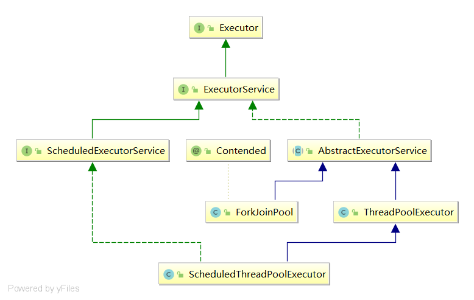

### 1. 两个重要的接口

Executor用于应用程序执行

``` bash
public interface Executor {
    	void execute(Runnable command);
}
```

ExecutorService新增应用程序生命周期管理

``` bash
public interface ExecutorService extends Executor {
      // 平缓方式关闭：不在接受新的任务，同时等待已经提交的任务执行完成(包括呢些已提交还没未开始执行的任务)
  	 	void shutdown(); 
      // 粗暴的关闭：尝试取消所有运行中的任务，并且不在启动队列中尚未开始执行的任务，返回从未执行的任务列表
  	 	List<Runnable> shutdownNow(); 
  	 	boolean isShutdown();
      // 是否已经终止
  	 	boolean isTerminated();
      // 阻塞直到到达终止状态
  	 	boolean awaitTermination(long timeout, TimeUnit unit) throws InterruptedException;
      // 传入n个Callable任务，按序返回一组Future
      <T> List<Future<T>> invokeAll(Collection<? extends Callable<T>> tasks) throws InterruptedException;
}
```

### 2. 线程池



线程池与工作队列密切相关，工作队列中存取所有等待执行的任务，工作线程在工作队列中获取一个任务，执行任务，然后返回线程池等待执行下一个任务

可以通过Executors中的静态方法来创建线程池：

``` bash
public class Executors {

    		// 创建固定长度的线程，达到最大规模后，如果某一线程Exception结束，
        // 线程池会补充一个新的线程；采用LinkedBlockingQueue
    		public static ExecutorService newFixedThreadPool(int nThreads) {
           	 		return new ThreadPoolExecutor(nThreads, nThreads,
                                          0L, TimeUnit.MILLISECONDS,
                                          new LinkedBlockingQueue<Runnable>());
        }

      	// 创建可缓冲的线程池，当线程池当前规模超过处理需求时，回收空闲线程; 
        // 当需求增加时，创建新的线程，线程池的规模不受限制(需求突增，规模可怕，慎用!)
      	// 采用SynchronousQueue，A synchronous queue does not have any internal capacity
      	public static ExecutorService newCachedThreadPool() {
         			  return new ThreadPoolExecutor(0, Integer.MAX_VALUE,
                                        60L, TimeUnit.SECONDS,
                                        new SynchronousQueue<Runnable>());
      	}

      	// 单线程Executor, FinalizableDelegatedExecutorService: 静态内部类, 继承自DelegatedExecutorService;
        // 采用LinkedBlockingQueue
      	public static ExecutorService newSingleThreadExecutor(ThreadFactory threadFactory) {
          		  return new FinalizableDelegatedExecutorService
              			(new ThreadPoolExecutor(1, 1,
                                      0L, TimeUnit.MILLISECONDS,
                                      new LinkedBlockingQueue<Runnable>(),
                                      threadFactory));
      	}

      	// 固定长度的线程池，延迟或者定时的方式执行任务;
        // 采用ScheduledThreadPoolExecutor.DelayedWorkQueue
      	public static ScheduledExecutorService newScheduledThreadPool(int corePoolSize) {
          	   	return new ScheduledThreadPoolExecutor(corePoolSize);
      	}
}
```