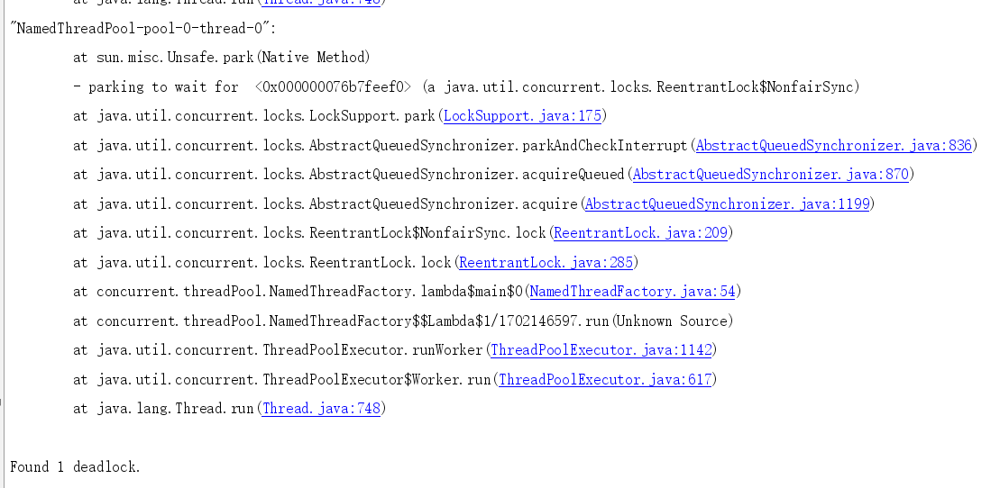

# 1. ThreadPoolExecutor构造参数详解

## 1.1 corePoolSize与maximumPoolSize

ThreadPoolExecutor将根据corePoolSize与maximumPoolSize自动调整线程池的大小。当新任务在方法execute(java.lang.Runnable)中提交时**如果池中当前运行线程数量少于corePoolSize,则新创建线程来处理请求，即使其他线程是空闲的;如果池中当前运行线程数量多于corePoolSize而小于maximumPoolSize,则仅当队列满时才新创建线程**(由此可得，若队列无界，maximumPoolSize无效，池中线程数始终为corePoolSize；若队列有界，maximumPoolSize无界，则允许任意数量的并发)

## 1.2 keepAliveTime与timeUnit

池中线程数多于corePoolSize时，线程空闲时间超过以timeUnit为单位的时间keepAliveTime后，则终止，避免资源浪费。默认情况下，保持活动资源策略不应用于corePoolSizeThreads,但是只要keepAliveTime不为0，可以通过allowsCoreThreadTimeOut(boolean)方法将此超时策略应用于核心线程。

## 1.3 workQueue

所有BlockingQueue都可用于传输与保持提交的任务，可以用此队列与池进行交互(以下称交互规则)：

+ 如果池中当前运行线程数少于corePoolSize,则Executor首选创建线程处理任务，而非将任务入队列
+ 如果池中当前运行线程数等于或多余corePoolSize,则Executor首选将任务入队列，而非田创建线程处理任务
+ 如果队列已满且线程数小于maximumPoolSize,则创建线程处理任务，除非线程数超过maximumPoolSize,则新任务被拒绝

任务排队有三种策略：

+ 直接提交 工作队列的默认选项 SynchronousQueue，它将任务直接提交给线程而不是加入队列，如果不存在可以立即运行的线程则创建线程，故通常要求无界maximumPoolSizes以避免拒绝新任务。此策略可以避免在处理可能具有内部依赖性的请求集时出现锁。
+ 无界队列 如不具有预定义容量的 LinkedBlockingQueue,由于无界加对队列与池的交互规则，故池中当前运行线程数始终不会超过corePoolSize。在Web页处理器中，此策略可处理瞬态突发情况
+ 有界队列 如ArrayBlockingQueue有助于防止资源耗尽

## 1.4 threadFactory

使用ThreadFactory创建新线程。如果没有另外说明，则在同一个ThreadGroup中使用Executors.defaultThreadFactory创建线程，并且这些线程拥有相同的NORM_PRIORITY优先级和非守护进程状态。通过提供不同的ThreadGroup,可以改变线程的名称、线程组、优先级、守护进程状态。如果newThread返回null时ThreadFactory未能成功创建线程，则程序继续执行，但不能执行任何任务。

## 1.5 handler

+ 当有界队列已满且池中运行线程数等于maximumPoolSize
+ Executor关闭
以上两种情况发生后，对于新任务，ThreadPoolExecutor.exceute方法将执行RejectedExecutionHandler的rejectedExecution(Runnable, ThreadPoolExecutor),有以下四种饱和策略：

**中止策略(ThreadPoolExecutor.AbortPolicy):** 该策略抛出未检查的RejectedExecutionException
**调用者运行策略(ThreadPoolExecutor.CallerRunsPolicy):** 该策略不会抛弃任务，也不会抛出异常，而是把任务回退给调用者执行
**抛弃策略(ThreadPoolExecutor.DiscardPolicy):** 抛弃任务不执行
**抛弃最旧策略(ThreadPoolExecutor.DiscardOldestPolicy):** 抛弃队列中下一个被执行的任务。 由于优先队列下一任务为优先级高者，故不可与该策略结合使用

# 2. 自定义ThreadFactory

**在使用ThreadPoolExecutor的时候，建议编写自己的ThreadFactory,这样在使用jstack工具查看内存中线程时，可很容易看出线程所属线程池，这对于在生产环境中解决死锁问题非常有帮助**

``` java
public class NamedThreadFactory implements ThreadFactory {

    private static AtomicInteger poolId;
    private static ThreadGroup threadGroup;
    private static AtomicInteger threadId;
    private static String threadNamePrefix = "NamedThreadPool";

    public NamedThreadFactory() {
        poolId = new AtomicInteger();
        threadGroup = new ThreadGroup("NamedThreadFactory");
        threadId = new AtomicInteger();
    }

    @Override
    public Thread newThread(Runnable r) {
        String name = threadNamePrefix + "-pool-" + poolId + "-thread-" + threadId.getAndIncrement();
        Thread thread = new Thread(threadGroup, r, name);
        return thread;
    }

    public static void main(String[] args) {
        int corePoolSize = 2;
        int maximumPoolSize = 4;
        long keepAliveTime = 1000;
        ThreadPoolExecutor threadPoolExecutor = new ThreadPoolExecutor(corePoolSize, maximumPoolSize,
                keepAliveTime, TimeUnit.MILLISECONDS, new SynchronousQueue<>());
        threadPoolExecutor.setThreadFactory(new NamedThreadFactory());

        Lock lockOne = new ReentrantLock();
        Lock lockTwo = new ReentrantLock();

        threadPoolExecutor.execute(() -> {
            lockOne.lock();
            try {
                Thread.sleep(1000);
            } catch (InterruptedException e) {
                e.printStackTrace();
            }
            lockTwo.lock();
        });

        threadPoolExecutor.execute(() -> {
            lockTwo.lock();
            try {
                Thread.sleep(2000);
            } catch (InterruptedException e) {
                e.printStackTrace();
            }
            lockOne.lock();
        });
    }
}
```

首先jps查看所有进程pid，jstack打印对应pid堆栈信息 jstack 1156 > /opt/temp/dump，结果如下：

