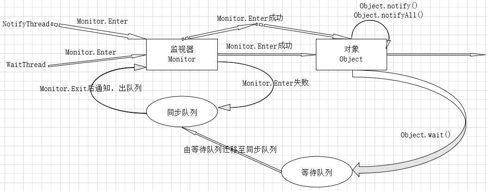

### 1. 使用注意事项

1) wait/notify(All)可用于线程间(线程数量>3)通信

2) 永远在synchronized方法或对象里使用wait/notify(All),不然JVM报java.lang.IllegalMonitorStateException

3) 永远在while循环里使用wait，防止其他原因改变先前判断条件

4) 永远在线程间共享对象(生产者消费者中为缓冲区队列)上使用wait/notify(All)

5) 多线程间协作，更倾向于使用notifyAll，唤醒在该对象上等待的全部线程


### 2. 实现生产者消费者

``` java
public class ProducerConsumerDemo {

    public static void main(String[] args) {
        Queue<Integer> queue = new LinkedList<>();
        int maxSize = 10;

        Thread producer = new Thread(new Producer(queue, maxSize));
        producer.setName("Producer");

        Thread consumerOne = new Thread(new Consumer(queue, maxSize));
        consumerOne.setName("ConsumerOne");

        Thread consumerTwo = new Thread(new Consumer(queue, maxSize));
        consumerTwo.setName("ConsumerTwo");

        producer.start();
        consumerOne.start();
        consumerTwo.start();
    }
}

class Producer implements Runnable {

    private Queue<Integer> queue;
    private int maxSize;

    public Producer(Queue<Integer> queue, int maxSize) {
        this.queue = queue;
        this.maxSize = maxSize;
    }

    @Override
    public void run() {
        Random random = new Random();
        while (true) {
            synchronized (queue) {
                while (queue.size() == maxSize) {
                    try {
                        System.out.println("Queue is full, Producer " + Thread.currentThread().getName() + " waiting");
                        queue.wait();
                    } catch (InterruptedException e) {
                        e.printStackTrace();
                    }
                }
                int value = random.nextInt();
                System.out.println("Producer " + value);
                queue.add(value);
                queue.notifyAll();

                try {
                    Thread.sleep(1000);
                } catch (InterruptedException e) {
                    e.printStackTrace();
                }
            }
        }
    }
}

class Consumer implements Runnable {

    private Queue<Integer> queue;
    private int maxSize;

    public Consumer(Queue<Integer> queue, int maxSize) {
        this.queue = queue;
        this.maxSize = maxSize;
    }

    @Override
    public void run() {
        while (true) {
            // synchronized方法或对象里使用wait/notify(All),不然JVM报java.lang.IllegalMonitorStateException
            synchronized (queue) {
                // while不可改为if,如果改为if，则可能抛出java.util.NoSuchElementException
                // 当前等待的线程被唤醒时，但是由于其他消费者刚好消费完，使得队列为空
                // 此时如果不重新判断队列为空，代码继续向下执行queue.remove势必抛出java.util.NoSuchElementException
                // 若放入while循环中重新判断条件，若条件不满足，线程则继续挂起，无影响
                while (queue.isEmpty()) {
                    try {
                        System.out.println("Queue is empty, Consumer " + Thread.currentThread().getName() + " waiting");
                        queue.wait(); // 在线程间共享对象(生产者消费者中为缓冲区队列)上使用wait/notify(All)
                    } catch (InterruptedException e) {
                        e.printStackTrace();
                    }
                }
                System.out.println(Thread.currentThread().getName() + " consume " + queue.remove());
                queue.notifyAll(); // 多线程间协作，更倾向于使用notifyAll，唤醒在该对象上等待的全部线程

                try {
                    Thread.sleep(1000);
                } catch (InterruptedException e) {
                    e.printStackTrace();
                }
            }
        }
    }
}
```

执行结果：

``` bash
Queue is empty, Consumer ConsumerOne waiting
Queue is empty, Consumer ConsumerTwo waiting
Producer -1203276467
Producer 626398544
Producer -108152878
Producer -705401944
ConsumerTwo consume -1203276467
ConsumerTwo consume 626398544
ConsumerTwo consume -108152878
ConsumerTwo consume -705401944
Queue is empty, Consumer ConsumerTwo waiting
Queue is empty, Consumer ConsumerOne waiting
Producer -1487489511
Producer 420807949
Producer 428506738
ConsumerOne consume -1487489511
ConsumerTwo consume 420807949
ConsumerTwo consume 428506738
Queue is empty, Consumer ConsumerTwo waiting
Queue is empty, Consumer ConsumerOne waiting
Producer 1411031303
Producer 1426589341
Producer -1307293143
Producer -970522822
Producer -2074755062
ConsumerOne consume 1411031303
ConsumerOne consume 1426589341
```

### 3. wait/nofity内部运行细节

1) 使用wait()、notify()、notifyAll()时需要先对对象加锁
2) 调用wait()方法后，线程状态由RUNNING变为WAITTING,并将当前线程放置到对象的等待队列
3) notify()、notifyAll()方法调用后，等待线程依旧不会从wait()返回，需要调用notify()、notify()的线程释放锁后，等待线程才有机会从wait()返回
4) notify()、notifyAll()方法将线程从等待队列移到同步队列(前者移1个，后者移全部),被移动的线程由WAITTING变为BLOCKED
5) 从wait()方法返回的前提是获得了调用对象的锁[这也是3)中为啥说有机会返回的原因]



### 4. sleep与wait的区别

sleep是Thread中定义的方法, wait是Object中定义的方法;

可以在任何地方调用线程对象的sleep方法，wait方法只能在同步代码块或同步方法中调用；

调用线程对象的sleep方法后，不释放锁，调用对象的wait方法，释放对象获得的锁